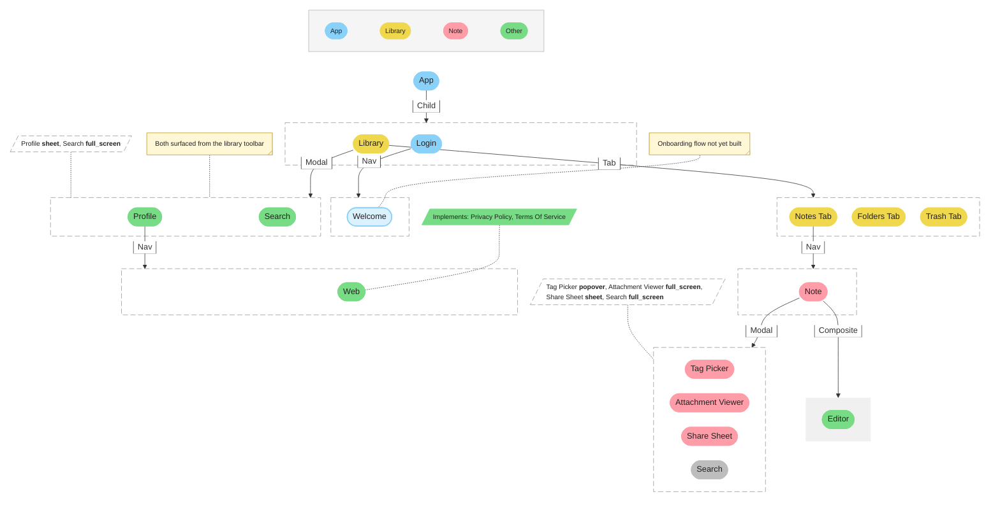

# UI Map Demo

A complete UI Map shown in both representations: YAML source (the source of truth) and the Mermaid render derived from it. For feedback on the format and the render.

Examples use **LumenNotes**, skai's shared fictional theme. The schema and conventions are project-agnostic.

## YAML

```yaml
version: 1
app: LumenNotes

modal_styles: [sheet, full_screen, card, popover]

domains:
  app:                                    # collapsed (domain == root scene)
    child:
      - library                           # cross-domain ref
      - login:
          nav:
            - welcome:
                todo: true
                note: "Onboarding flow not yet built"

  library:                                # collapsed
    tab:
      - notes_tab:
          nav:
            - note                        # cross-domain ref
      - folders_tab: {}
      - trash_tab: {}
    modal:
      - profile                           # cross-domain ref
      - search                            # cross-domain ref (reused)
    notes:
      - at: modal
        text: "Both surfaced from the library toolbar"

  note:                                   # collapsed
    composite:
      - editor                            # cross-domain ref
    modal:
      - tag_picker:
          modal_style: popover
      - attachment_viewer:
          modal_style: full_screen
      - share_sheet:
          modal_style: sheet
      - search                            # cross-domain ref (reused, pointer here)

  other:                                  # not collapsed (no common root)
    scenes:
      - profile:
          modal_style: sheet
          nav:
            - web                         # ref to common
      - search:
          modal_style: full_screen
          primary_parent: library         # canonical visual position
      - editor: {}

common:
  - web:
      implements: [privacy_policy, terms_of_service]

todos:
  - scope: folders_tab
    note: "Subfolder navigation planned for v2"
```

## Mermaid render



## Notes on what's where

- **Wrappers per route.** Every route container in the YAML (`nav:`, `modal:`, `composite:`, `tab:`, `child:`) becomes a wrapper subgraph in the render. Even single-target routes get a wrapper. The route-kind label sits on the incoming arrow.
- **Canonical placement via `primary_parent`.** `Search` is YAML-organized under `other:` but its `primary_parent: library` puts the canonical instance in the `library_modal` wrapper. The reference from `note.modal` renders as a gray pointer (`Search_at_note`).
- **Gray fill marks non-canonical references.** Pointer nodes use the same shape as canonical scenes, distinguished by fill color only.
- **Root scenes are not wrapped.** `App` is the root: no incoming route, no enclosing wrapper. Matches the FigJam convention.
- **`common:` scenes render at their consumer.** `Web` is YAML-organized under `common:` (domain-agnostic), but the render places its canonical instance inside its only consumer's Nav wrapper (`profile_nav`), since it has a single inbound route. If Web were referenced from multiple consumers, a `primary_parent` would pick the visual home.
- **Scene fill encodes domain.** Each domain maps to a palette color (in YAML declaration order). The Domain Legend block at the top maps domain to color.
- **Mutex vs. composite wrappers are visually distinct.** Mutex wrappers use a dashed border with white fill; composite wrappers use light-gray fill with no border.
- **`Implements:` callouts.** Right-leaning parallelograms attached to the abstract scene via a dashed connector, with single-line comma-separated implementations. Fill matches the attached scene's domain color.
- **Modal-style callouts.** The project declares a `modal_styles` vocabulary; each scene reached by a modal route tags itself with a `modal_style`. For every modal wrapper, the render emits a callout — a parallelogram styled like the mutex wrapper (white fill, dashed gray border) — listing each destination and its bolded style on a single comma-separated line. The callout annotates the wrapper, not any one scene.
- **TODO scenes and notes.** `Welcome` is flagged `todo: true` in YAML. A TODO scene keeps its domain identity but signals the unimplemented state: full-opacity domain color as a 2px stroke, with the domain color at 0.3 alpha as the fill. `Welcome` also has a `note:` rendering as a pale-yellow sticky-note callout (a `tag-rect` shape). The two are independent — a scene can have either, both, or neither.
- **Container-attached notes.** A `notes:` entry on a scene can use `at: <route-kind>` to attach to a route container (wrapper) rather than the scene itself.
- **Auto-layout caveat.** Mermaid lays out the graph automatically; positions won't match the FigJam exactly. Topology, grouping, and edge labels match; relative positions within a domain are the renderer's choice.
